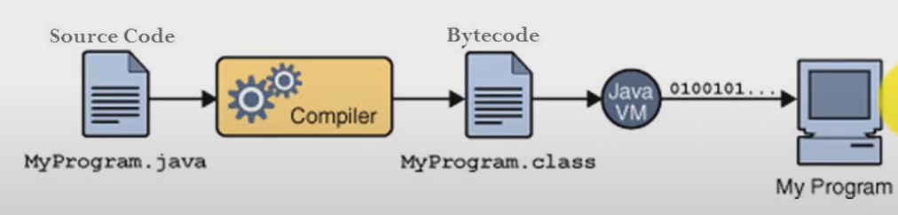
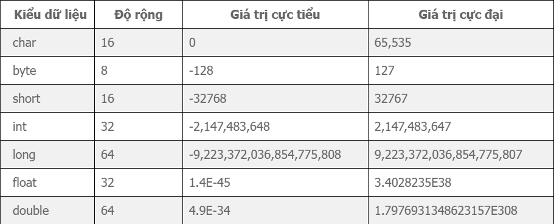
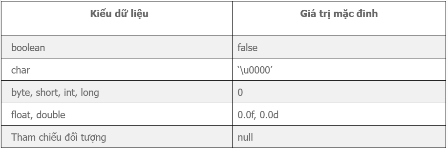

# Tổng Quan và Cơ Bản về Java
----
#### 1. Ngôn ngữ Java là gì?
- Java là một ngôn ngữ lập trình thuần hướng đối tượng được phát triển bới Sun Microsystems. 
- Java nổi tiếng với phương châm "Viết một làna, chạy mọi nơi". Chương trình phần mềm bằng Java có thể chạy trên mọi nền tảng nhờ môi trường chạy máy ảo Java (JVM).
#### 2. Lí do ra đời của Java?
Java ra đời vào đầu những năm 1990 với mục đích ban đầu là tạo ra một ngôn ngữ lập trình có thể vận hành trên nhiều thiết bị và hệ điều hành khác nhau.
#### 3. Cách Java hoạt động, điều gì xảy ra khi chạy code Java (.java) ?
- Viết mã nguồn (.java)
- Chạy file source cide bằng trình biên dịch (compiler). Compiler sẽ kiểm tra lỗi, biên dịch sẽ hoàn tất nếu không có lỗi xảy ra.
- Compiler tạo ra file mới, được mã hoá thành **Java bytecode**. Bất kì thiết bị nào có khả năng chạy Java đều có thể **thông dịch (interpret)**  file này sang thứ gì đó mà có thể chạy.
- Các thiết bị được cài đặt máy ảo Java(JVM - Java virtual machine). Khi các thiết bị chạy, JVM sẽ đọc và chạy các file bytecode.


#### 4. Cấu trúc một chương trình Java ?
Cấu trúc cơ bản của một chương trình java:
```js
public class Classname{
    pubic static void main(String[] args){
        // Các câu lệnh
    }
}
```
#### 5. Package là gì ?
- Một Package trong Java là một nhóm các class, interface và các package con tương tự, liên quan đến nhau.
- Chúng ta có thể coi package như một folder.
- Các package trong Java được sử dụng để tránh việc xung đột khi đặt tên, để kiểm soát truy cập, giúp tìm kiếm và sử dụng các class, interface.. một cách dễ dàng hơn.
- Các package được chia thành 2 loại:
a. Các package được tích hợp sẵn từ Java API (Built-in packages).
b. Các package do người dùng tự định nghĩa (đây là package do bạn tự tạo ra) - User defined packages.
#### 6. Syntax cơ bản:
##### a) Khai báo biến nguyên thuỷ
Kiểu dữ liệu trong Java



Các giá trị mặc định cho các biến kiểu dữ liệu nguyên thuỷ trong Java



Java có hai kiểu khai báo biến:
- Cho phép thay đổi giá trị của biến trong chương trình
*Khai báo biến / Khởi tạo biến :* [kiểu dữ liệu] tên_biến [= giá_trị];
```js
// khai báo biến
int a;
byte tuoi;
float diemToan;
// khai báo nhiều biến cùng kiểu dữ liệu
int c, d, e;
```

```js
// Khởi tạo biến
int a = 10;
float b = 5.5f;
double c = 7.2d;
```

- Không cho phép thay đổi giá trị của biến trong chương trình (Hằng số)
final [kiểu dữ liệu] tên_biến [= giá trị];
```js
// hằng số thường viết hoa hết
final int DOSOI = 100;
```
Quy tắc đặt tên biến:
> 1. Tên biến chỉ chứa chữ cái, chữ số, dấu gạch chân, và dấu $.
> 2. Tên biến không được bắt đầu bằng chữ số
> 3. Tên biến không được trùng với từ khoá và từ dành riêng cho Java
> 4. Tên biến phân biệt hoa / thường.

##### b) Vòng lặp
- Vòng lặp for:
    Cú pháp
    ```js
    for (khoi_tao_bien; check_dieu_kien; tang/giam_bien){
        // khối lệnh được thực thi
    }
    ```
    Ví dụ:
    ```js
    public class ForExample{
        public static void main(String[] args){
            for(int i = 1; i <= 10; i++){
                System.out.println(i);
            }
        }
    }
    ```
- Vòng lặp while:
    Ví dụ:
    ```js
    public class ForExample{
        public static void main(String[] args){
            int i = 1;
            while(i <= 10){
                System.out.println(i);
            }
        }
    }
    ```
- Vòng lặp do - while:
    Ví dụ:
    ```js
    public class ForExample{
        public static void main(String[] args){
            int i = 1, sum = 0;
            do{
                sum += i;
                i++;               
            }while(i <= 5);
            System.out.println("Sum of 1 to 5 is" + sum);
        }
    }
    ```
##### c) Câu lệnh rẽ nhánh
- If else:
    Cấu trúc không có gì khác so với C++.
    Ví dụ:
    ```js
    public class Test {
        public static void main(String[] args) {
            int number = 13;
            if (number % 2 == 0) {
                System.out.println("Số " + number + " là số chẵn.");
            } else {
                System.out.println("Số " + number + " là số lẻ.");
            }
        }
    }
    ```
- Switch - case:
    Ví dụ:
    ```js
    public class SwitchExample {
        public static void main(String[] args) {
            int number = 20;
            switch (number) {
            case 10:
                System.out.println("10");
                break;
            case 20:
                System.out.println("20");
                break;
            case 30:
                System.out.println("30");
                break;
            default:
                System.out.println("Not in 10, 20 or 30");
            }
        }
    }
    ```
##### d) Mảng
- Khai báo:
    Mảng 1 chiều: dataType[] arr; hoặc dataType arr[];
    Mảng 2 chiều: dataType [][] arr; hoặc dataType arr [][];
- Độ dài mảng: arr.length;
#### 7. Tổng quan về Class và Object:
##### a) Lớp (Class):
- Lớp được khai báo 1 lần duy nhất
- Lớp là một mẫu hoặc thiết kế từ đó các đối tượng được tạo ra.
- Một lớp là một nhóm đối tượng có các thuộc tính chung.
- Lớp không được cấp bộ nhớ khi nó được tạo ra
- Chỉ có 1 cách để định nghĩa lớp trong Java là sử dụng từ khoá Class
- Một lớp trong Java có thể chứa:
-- Thành viên dữ liệu
-- Constructor
-- Phương thức
-- Khối lệnh
-- Lớp và interface
Ví dụ: Tạo ra một lớp Student có 2 thành viên dữ liệu là id và name.
```js
public class Student {
    int id; // thành viên dữ liệu
    String name; // thành viên dữ liệu
 
    public static void main(String args[]) {
        Student student1 = new Student(); // tạo một đối tượng student1
        System.out.println(student1.id);
        System.out.println(student1.name);
    }
}
```
##### b) Đối tượng ( Object)
- Đối tượng là thể hiện của 1 Lớp
- Đối tượng được tạo ra chủ yếu từ từ khoá new. Ví dụ: Student s1 = new Student();
- Đối tượng có thể được tạo nhiều lần
- Đối tượng được cấp bộ nhớ khi nó được tạo ra
- Có rất nhiều cách để tạo ra đối tượng trong java như từ khóa new, phương thức newInstance(), phương thức clone(), phương thức factory và deserialization.
Trong ví dụ trên thì student1 là 1 object.
##### c) Các từ khoá:
- This: Là một biến tham chiếu được sử dụng để tham chiếu tới đối tượng của lớp hiện tại.
    Công dụng của this:
    > 1. Từ khóa this có thể được dùng để tham chiếu tới biến instance của lớp hiện tại.
    > 2. This() có thể được dùng để gọi Constructor của lớp hiện tại.
    > 3. Từ khóa this có thể được dùng để gọi phương thức của lớp hiện tại.
    > 4. Từ khóa this có thể được truyền như một tham số trong phương thức.
    > 5. Từ khóa this có thể được truyền như một tham số trong phương Constructor.
    > 6. Từ khóa this có thể được dùng để trả về instance của lớp hiện tại.

    Chú ý: this() phải được khai báo dòng lệnh đầu tiên trong Constructor.
- Constructor: Là một dạng đặc biệt của phương thức được sử dụng để khởi tạo các đối tượng. Java Constructor được gọi tại thời điểm tạo đối tượng. Nó khởi tạo các giá trị để cung cấp dữ liệu cho các đối tượng, đó là lý do tại sao nó được gọi là constructor.
    Quy tắc tạo constructor:
    > 1. Tên constructor phải giống tên lớp chứa nó.
    > 2. Constructor không có kiểu trả về tường minh.

    Các kiểu constructor: Constructor mặc định và Constructor tham Số
-- Constructor mặc định: Cung cấp các giá trị mặc định như 0, null, (tuy thuộc vào kiểu dữ liệu).. tới đối tượng được khởi tạo
Cú pháp
    ```js
    <class_name>() {
        // code
    }
    ```
    Ví dụ:

    ```js
    class Bike1 {  
        Bike1() {
            System.out.println("Bike is created");
        }  
        public static void main(String args[]) {  
        Bike1 b=new Bike1();  
        }  
    }
    ```
    Chú ý: Nếu không có constructor trong một lớp, trình biên dịch sẽ tự động tạo một constructor mặc định trong lớp đó.
-- Constructor tham số: Cung cấp các giá trị khác nhau cho các đối tượng khác nhau
    Ví dụ:

    ```js
    class Student4{  
        int id;  
        String name;  
        
        Student4(int i,String n) {  
            id = i;  
            name = n;  
        }  
    }
    ```
- Access modifier: xác định phạm vi có thể truy cập của biến, phương thức, constructor hoặc lớp.
    Các phạm vi truy cập của Access modifier:
> 1. private: Chỉ được truy cập trong phạm vi lớp.
> 2. default: Chỉ được truy cập trong cùng package.
> 3. protected: Được truy cập bên trong package và bên ngoài package nhưng phải kế thừa.
> 4. public : Truy cập được ở mọi nơi

Chú ý: Một lớp không thể là private hoặc protected, ngoại trừ lớp lồng nhau
- Setter: Truyền một dữ liệu vào một giá trị nào đó.
- Getter: Lấy dữ liệu từ một giá trị ra.
Chú ý: Setter và getter nhằm quản lí truy cập của thuộc tính, thì ta không nên để thuộc tính có thể truy cập dễ dàng, không nên để ở dạng public
Cú pháp
a. Setter:
```js
public void set<tên thuộc tính> (<tham số giá trị mới>) {
      this. <tên thuộc tính> = <tham số giá trị mới>;
 }
```
b. Getter
```js
public <kiểu dữ liệu thuộc tính> get<tên thuộc tính> () {
      return this. <tên thuộc tính>;
 }
```

- Static:sử dụng để quản lý bộ nhớ, khi những thành viên bên trong một lớp có từ khóa static thì nó thuộc về lớp, không phải thuộc về riêng một đối tượng nào đó.
Trong Java, Static có thể là
> 1. Biến static: Khi bạn khai báo một biến là static, thì biến đó được gọi là biến tĩnh, hay biến static.
> 2. Phương thức static: Khi bạn khai báo một phương thức là static, thì phương thức đó gọi là phương thức static.
> 3. Khối static: Được sử dụng để khởi tạo thành viên dữ liệu static.


